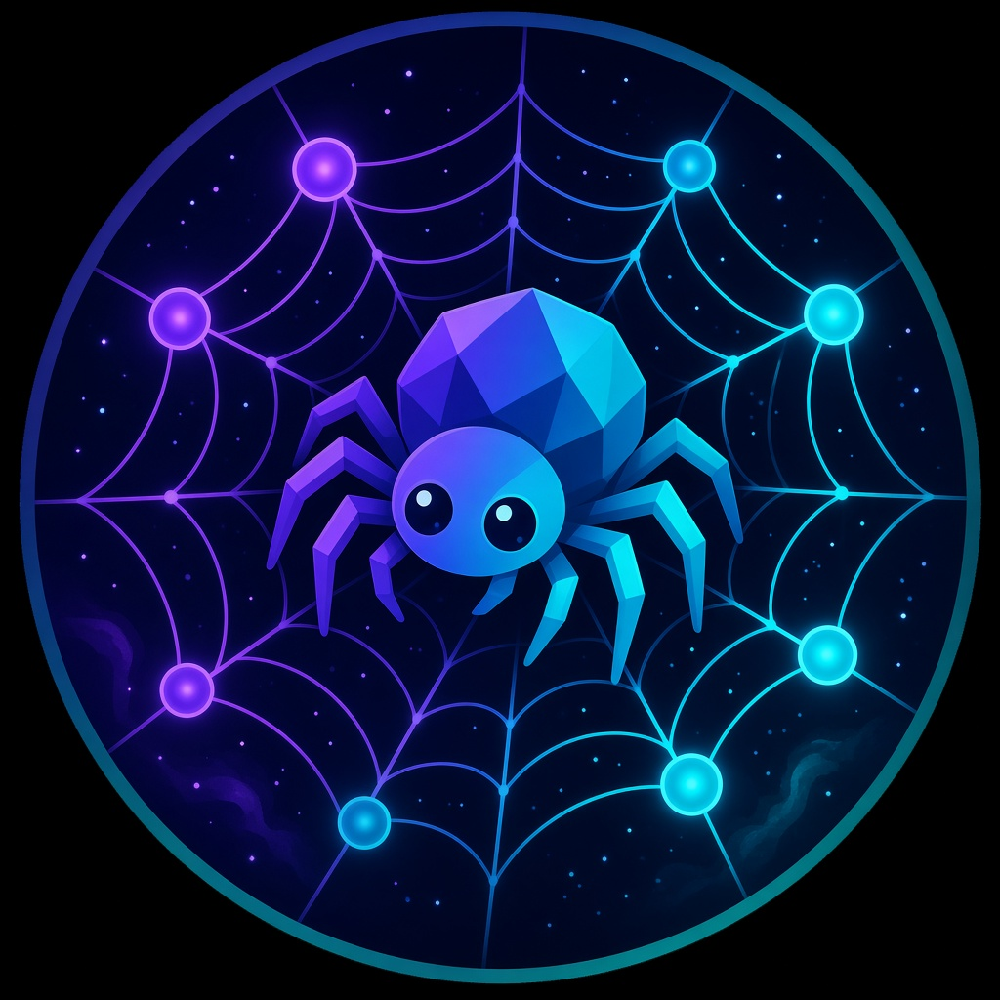

<p align="center">
  
</p>

<h1 align="center">🕸️ Orbweaver</h1>
<p align="center"><strong>Weave through Discord quests at lightspeed.</strong></p>

<p align="center">
  
  
  
  
</p>

---

Orbweaver is a Discord slash-command bot that completes your quests — **all at once, one by one, or turbo-fast**. No MySQL. No cloud database. Just clone, configure, and run.

## Why Orbweaver?

| Feature | What it does |
|---------|-------------|
| 🕸️ **Blaze** | Complete every quest **simultaneously** |
| 🎭 **Parade** | One quest after another, steady and safe |
| 🪙 **Orb Hunt** | Prioritize high-orb reward quests first |
| 💎 **Heavy Lift** | Tackle the longest quests first |
| 🚀 **Turbo** | 15-minute quests done in ~1 minute |
| 🔐 **Encrypted tokens** | Stored locally in SQLite, never logged |
| ⚡ **SQLite, not MySQL** | Instant reads/writes, zero setup |

## Quick Start

### 1. Clone & install

```bash
git clone https://github.com/shrujan-sb/Discord-Auto-Quest.git
cd Discord-Auto-Quest
npm install
```

### 2. Create your bot

1. Go to [Discord Developer Portal](https://discord.com/developers/applications)
2. **New Application** → name it `Orbweaver`
3. **Bot** tab → Reset Token → copy it
4. Enable **Message Content Intent** (not required but good practice)
5. **OAuth2 → URL Generator** → scopes: `bot`, `applications.commands` → invite to your server

### 3. Configure

```bash
cp .env.example .env
```

Edit `.env`:

```env
DISCORD_BOT_TOKEN=your_bot_token
DISCORD_CLIENT_ID=your_application_id
DISCORD_GUILD_ID=your_server_id    # optional, faster command deploy
ENCRYPTION_KEY=generate_a_random_32_byte_hex_key
```

Generate an encryption key:

```bash
node -e "console.log(require('crypto').randomBytes(32).toString('hex'))"
```

### 4. Deploy commands & start

```bash
npm run deploy
npm run dev
```

That's it. Orbweaver is live.

## Commands

### Token Management
| Command | Description |
|---------|-------------|
| `/thread-token add` | Save your Discord user token |
| `/thread-token verify` | Check if token is valid |
| `/thread-token list` | View saved tokens |
| `/thread-token remove` | Delete a token |

### Quest Weaving
| Command | Description |
|---------|-------------|
| `/radar` | Scan active quests |
| `/inspect` | Deep-dive a specific quest |
| `/blaze` | Complete **all** quests at once |
| `/parade` | Complete quests one by one |
| `/orb-hunt` | High-orb quests first |
| `/heavy-lift` | Longest quests first |
| `/turbo` | Lightspeed mode (~1 min) |
| `/pulse` | Live progress tracker |
| `/abort` | Stop everything |
| `/claim-loot` | Claim all completed rewards |

### Settings
| Command | Description |
|---------|-------------|
| `/loom-config view` | See your settings |
| `/loom-config turbo` | Toggle default turbo |
| `/loom-config auto-claim` | Toggle auto-claim |
| `/loom-config auto-enroll` | Toggle auto-enroll |

### Help
| Command | Description |
|---------|-------------|
| `/oracle` | Full command reference |

## How to get your Discord token

> ⚠️ Your user token is sensitive. Never share it publicly.

1. Open [Discord](https://discord.com/app) in your browser
2. Press `F12` → **Network** tab
3. Refresh the page (`Ctrl+R`)
4. Click any request to `discord.com`
5. Under **Headers**, find `Authorization` — copy the value
6. Use `/thread-token add` in Orbweaver

## Architecture

```
src/
├── bot.js              # Discord client
├── index.js            # Entry point
├── deploy-commands.js  # Slash command registration
├── commands/           # All slash commands
├── engine/
│   ├── discord-api.js  # Discord REST API (user token)
│   ├── quest-engine.js # Parallel/sequential/turbo completion
│   └── quest-parser.js # Quest type detection & sorting
├── database/
│   └── sqlite.js       # Fast local storage (no MySQL!)
└── utils/
    ├── embeds.js       # Rich UI embeds
    └── crypto.js       # Token encryption
```

## Turbo Mode

Normal video quests take ~15 minutes. Turbo mode accelerates timestamp submission so a 900-second quest finishes in roughly **60 seconds**. Game/stream quests use accelerated heartbeat intervals.

Set `TURBO_MULTIPLIER=15` in `.env` to tune the speed (higher = faster, but riskier).

## Why SQLite instead of MySQL?

MySQL adds network latency, connection pooling headaches, and hosting costs for a bot that stores a handful of encrypted tokens per user. SQLite with WAL mode gives you:

- **Sub-millisecond** reads/writes
- **Zero configuration** — just works
- **Single file** database in `./data/`
- **Perfect for** self-hosted bots

## Disclaimer

> ⚠️ **Use at your own risk.** Automating Discord quests may violate [Discord's Terms of Service](https://discord.com/terms). Discord has been known to flag accounts using quest automation. This tool is for educational purposes. The authors are not responsible for any account actions taken by Discord.

## License

MIT — see [LICENSE](LICENSE)

---

<p align="center">Made with 🕸️ by <a href="https://github.com/shrujan-sb">shrujan-sb</a></p>
